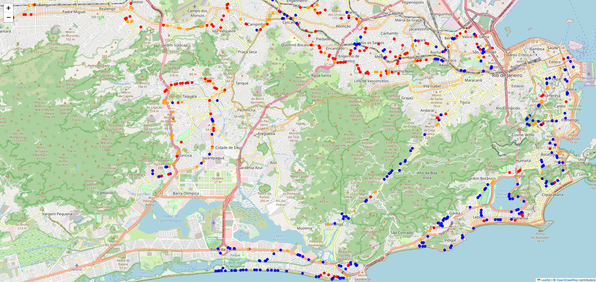

# Urban Heat Island Detection for Climate-Aware Urban Planning

## Context
This project is based on the Zindi "Urban Heat Island Challenge".
The goal is to identify urban heat island patterns using geospatial and environmental data.

The project is not optimized for leaderboard ranking.
The focus is on methodological clarity, interpretability, and relevance for urban climate adaptation.

## Problem Statement
Urban heat islands increase health risks, energy consumption, and reduce quality of life.
Identifying heat-prone areas can support targeted urban planning measures such as
tree planting, shading, and surface de-sealing.

## Approach
- Geospatial feature engineering using building footprints and road networks
- Multi-scale spatial context (50m / 100m / 200m buffers)
- Supervised baseline classification (logistic regression)
- Emphasis on interpretability and incremental feature refinement
- Evaluation using accuracy and class-balanced metrics

## Results
The project prioritizes explainable results over maximum accuracy.

A stepwise feature refinement approach was applied:
- Multi-scale building density and footprint area
- Road length features derived from OpenStreetMap
- Refined road length calculation using clipped geometries for the largest spatial context (200m)

This resulted in a steady performance improvement, reaching:
- Accuracy: ~0.55
- Macro F1-score: ~0.50

Low-UHI areas are identified reliably, while Medium-UHI remains challenging,
indicating transitional zones and the need for additional environmental features.

## Visualization

The figure below shows a spatial overview of the model predictions
for the Brazil sample dataset. Points are colored by predicted
Urban Heat Island class (Low / Medium / High).

This visualization highlights how the model responds to
urban structure, road density, and built-up areas.

## Limitations
- Baseline models without extensive hyperparameter optimization
- Simplified proxies for urban surface properties
- Medium UHI class represents transitional areas and is harder to separate
- Results are indicative and not intended for operational deployment

## Possible Extensions
- Integration of vegetation and water proximity features
- Temporal analysis with additional climate data
- Comparison with urban cooling measures

## Motivation
This project is part of a personal portfolio focused on
machine learning applications for climate adaptation in cities.

## Baseline results (Brazil, building features)

A logistic regression baseline using multi-scale building density (50m / 100m / 200m) 
and building footprint area achieves:

- Accuracy: ~0.51
- Macro F1-score: ~0.45

Low-UHI areas are identified reliably, while Medium-UHI remains challenging, 
indicating that additional environmental features (e.g. vegetation or surface properties) 
are required.

## Data
Raw training data is not included in this repository.

Expected structure:
data/
├─ raw/
│  ├─ Sample_Brazil_uhi_data.csv
│  └─ Brazil Building Footprints/
│     └─ *.shp